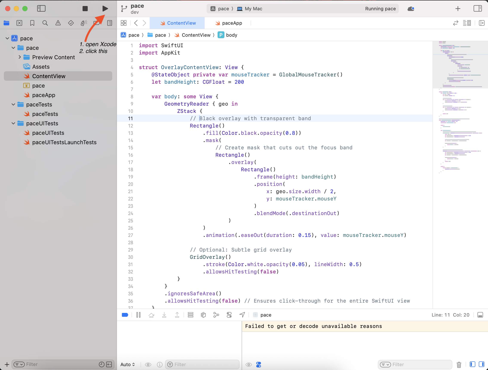

[](https://opensource.org/licenses/MIT)
[](https://www.apple.com/macos/)
[](https://swift.org/)

## What is Pace?
A. Reading focus tool. 
B. Overlay window to help with focus. 
#Insipred by the ADHD Accessibility feature in https://www.ux4g.gov.in/


## Installation

```bash
1. git clone this repo or download zip
2. go to the downloaded *pace* folder
3. open Pace.xcodeproj
# open it in Xcode, Build and run in Xcode
```


